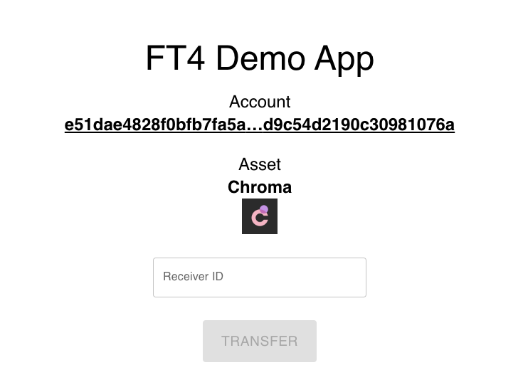

# FT4 Demo App

Welcome to the FT4 Demo App! This basic demonstration of the FT4 platform aims to provide an intuitive and practical guide to understanding its core features. For the best experience, we recommend using Google Chrome with the Metamask extension installed.

<div align="center">
    
</div>

## Prerequisites

- Docker
- Chromia Rell
- Node.js
- Google Chrome with Metamask extension

## Setup Instructions

### Postgres Installation

If the node is not already configured with Postgres, install it using the following Docker command:

```bash
docker run --name ft4_demo -e POSTGRES_INITDB_ARGS="--lc-collate=C.UTF-8 \
    --lc-ctype=C.UTF-8 --encoding=UTF-8" -e POSTGRES_USER=postchain \
    --tmpfs=/pgtmpfs:size=1000m -e PGDATA=/pgtmpfs -e POSTGRES_DB=postchain \
    -e POSTGRES_PASSWORD=postchain -p 5432:5432 -d postgres > /dev/null;
```

### Install Rell Dependencies

The Rell code relies on specific dependencies. To install these, use the following command:

```bash
chr install
```

### Generate Keypair

Several commands in this guide use the `--secret .secret` argument. To generate the `.secret` keypair file, use the following command:

```bash
chr keygen --save .secret
```

After generating the new keypair, remember to update the `admin_pubkey` field in `demo/rell.config.yml` with your new public key.

### Start Node

As the node serves as the backend for the React frontend, it should be launched before the frontend. To start the node, use the following command:

```bash
chr node start
```

### Set Up Client

Navigate to the client directory, install the necessary dependencies and start the client using the following commands:

```bash
cd client
npm install
npm start
```

## User Guide

With the prerequisites met and the FT4 demo app setup complete, you are ready to begin exploring the platform. The following sections will guide you through key features and functionalities.

### Register an Account

Use the following command to register an account. Replace `<Your_EVM_Address_Without_0x_Prefix>` with your EVM (Ethereum Virtual Machine) address, without the `0x` prefix:

```bash
chr tx ft4.admin.register_account \                                                              
    '[0, [["A","T"], x"<Your_EVM_Address_Without_0x_Prefix>"], null]' \
    --await --secret .secret
```

### Register an Asset

To register an asset, use the following command:

```bash
chr tx ft4.admin.register_asset TestAsset TST 6 http://url-to-asset-icon  --await --secret .secret
```

### Mint to Account

Mint an asset to an account using the following command. Replace `<account_id>`, `<asset_id>`, and `<amount>` with the relevant values:

```bash
chr tx ft4.admin.mint \
    "<account_id>" \
    "<asset_id>" \
    "<amount>" --await --secret .secret
```

Enjoy exploring the FT4 Demo App!
