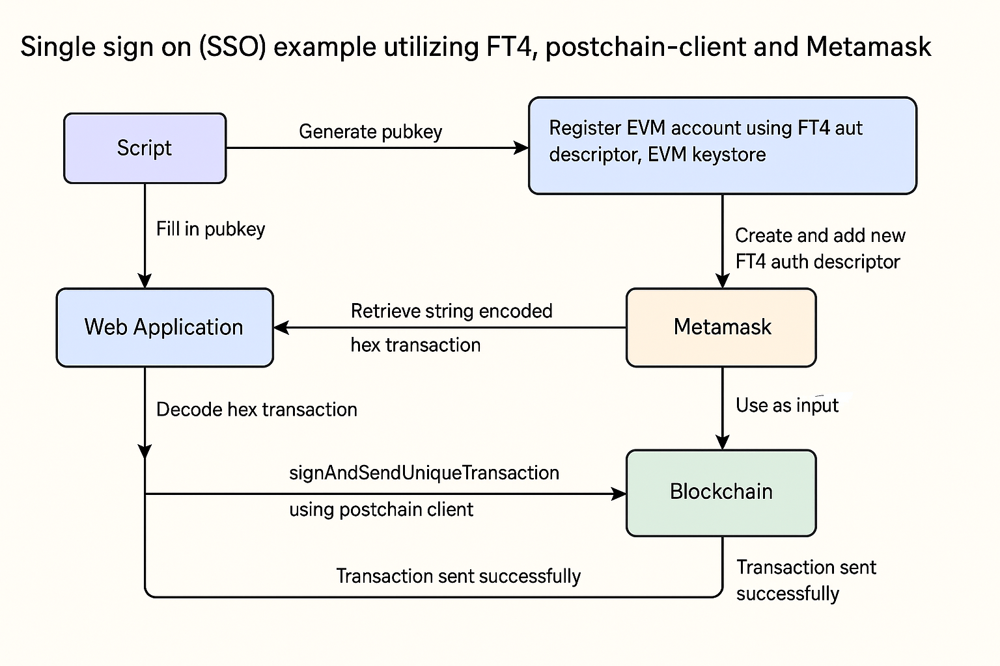

# SSO Metamask example on chromia utilizing `FT4` and `postchain-client`

This project aims to demonstrate SSO (single sign-on) with metamask, using
Chromia's `FT4` and `postchain-client` libraries. The example shows how to
authenticate users using their Metamask wallet and interact with the Chromia
blockchain.

## Prerequisites

- Docker & Docker compose
- Node.js ≥ v20
- Metamask installed as browser extension

## How to run it

1. Navigate to the `./examples/sso-metamask-example` directory
2. Run `npm install`
3. Run `chr install`
4. Ensure docker is up and running
5. `npm run start` to build and run the web app using docker
6. `chr node start --wipe --directory-chain-mock` to run the blockchain with
   directory chain mock **(It is worth noting directory chain runs on iid 0 and
   the dapp on iid 1)**
7. With the web app run on `localhost:8080` run `npm run cli`
8. Copy the terminals output pubkey e.g.
   `03F75F9E02F6A81293B4751FA33FB7CC2DA6E5D951A135CD99C060EBE1D871CF91`, paste
   it in the web apps input field and press the button "Enter".
9. Press the button "Connect Wallet" from the web app and sign both transaction
   using Metamask
10. Copy from the browser's console tab the string encoded transaction e.g.
    `A58201403082013CA481C73081C43081A90C0461726773A581A030819DA1220420C97E4323C528AE963856AFB1E4EA26FDC1DAF61B78A2C0D09ED1B90D97D8EBFBA12204200E33AA97AB2C786CCD0FD7B2744C9024834B4D106E58A2EDD0970484FB2D95BEA5533051A54F304DA12204206C3762C66709A256AE24DFD8427DBFB7D8B907928EF432FCC834C5197E334FD4A12204206CB3F3FF0B3BDECB9E1AF497D2E93DB98154612E61FFC47FEA589DE9BC8714EBA30302011B30160C046E616D65A20E0C0C6674342E65766D5F61757468A470306E30490C0461726773A541303FA53D303BA303020100A530302EA5073005A2030C0154A1230421036E685D2DC8F546CF7A2D70012544DFC252965008726201F6AFF8DB3D689B40B4A002050030210C046E616D65A2190C176674342E6164645F617574685F64657363726970746F72`
    and provide it as input in the cli script on the terminal (and press enter)

## SSO Flow Diagram

