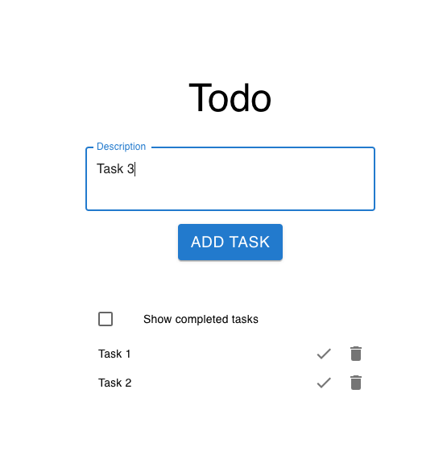

# TODO List Example

Welcome to the FT4 List Example! This basic demonstration of the FT4 library aims
to provide an intuitive and practical guide to understanding account registration and operation authorization.
For the best experience, we recommend using Google Chrome with the Metamask extension installed.

<div align="center">
    
</div>

## Prerequisites

- [Docker](https://docs.docker.com/get-docker/)
- [Chromia CLI](https://docs.chromia.com/getting-started/dev-setup/backend/cli-installation)
- [Node.js](https://nodejs.org/en/download/)
- [Google Chrome](https://www.google.com/chrome/) with
  [Metamask](https://metamask.io/download.html) extension installed

## Setup Instructions

### Postchain

In order to try out the example, first you have to start blockchain (Postchain). It can be started two ways. Either by simply running docker-compose, or by starting database and Postchain node manually. 

#### docker-compose
The easiest way to run blockchain is to navigate to the example directory
```sh
cd <ft4-root>/examples/todo-list
```
and then start database and Postchain node by calling
```sh
docker-compose up -d
```

Note: The first time when blockchain is started, FT4 has to be installed, and therefore it could take couple of minutes before blockchain is fully initialized and can accept connections from client.

### Manually starting database and node

#### Start Postgres

If the node is not already configured with Postgres, install it using the
following Docker command. This can be run on a new terminal window, on any
folder.

```bash
docker run --name todo-list-example-postgres -e POSTGRES_INITDB_ARGS="--lc-collate=C.UTF-8 \
    --lc-ctype=C.UTF-8 --encoding=UTF-8" -e POSTGRES_USER=postchain \
    --tmpfs=/pgtmpfs:size=1000m -e PGDATA=/pgtmpfs -e POSTGRES_DB=postchain \
    -e POSTGRES_PASSWORD=postchain -p 5432:5432 -d postgres > /dev/null;
```

#### Install Rell Dependencies

First of all, let's get into the rell folder of this demo app:

```sh
cd <ft4-root>/examples/todo-list/rell
```

The Rell code relies on specific dependencies. To install these, use the
following command:

```bash
chr install
```

#### Start Node

As the node serves as the backend for the React frontend, it should be launched
before the frontend. To start the node, use the following command:

```bash
chr node start --wipe
```

### Set Up Client

On a new terminal window, navigate to the client directory and install the
necessary dependencies using the following commands:

```bash
cd <ft4-root>/examples/todo-list/client
npm install
```

### Start the client

To start the client, you'll need to run the following command inside the
`client` folder:

```bash
npm start
```

The client won't be able to do much before you setup the blockchain, however.
Read the [User guide chapter](#user-guide) and start the front-end once
instructed to do so.
